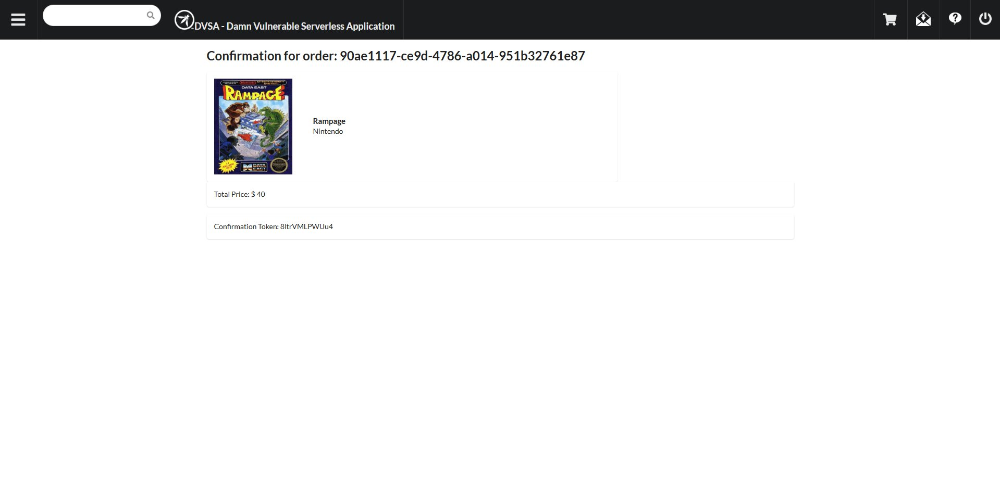
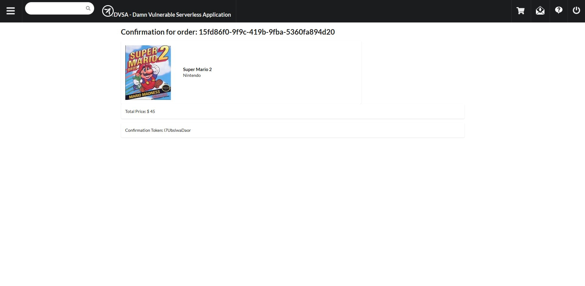
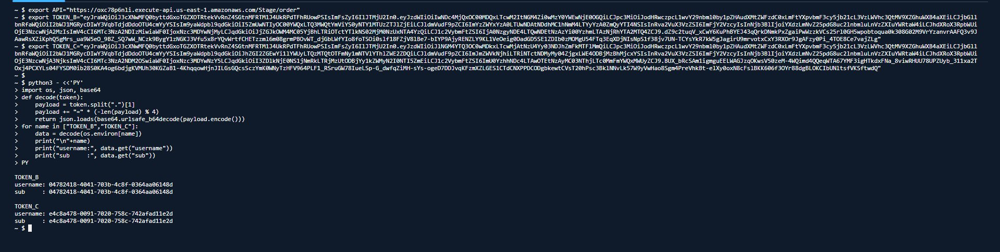
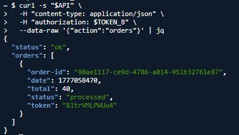
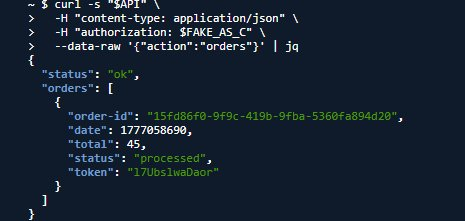
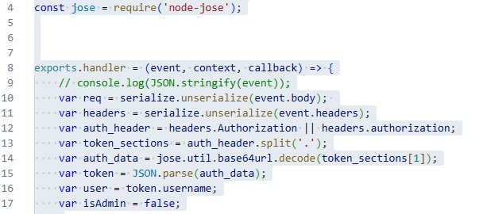
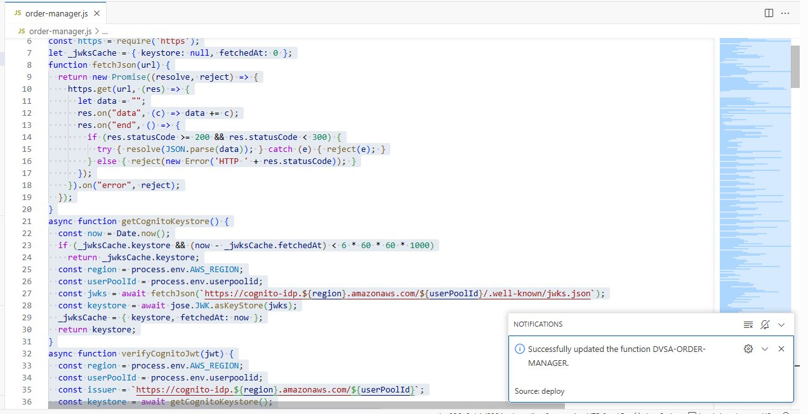
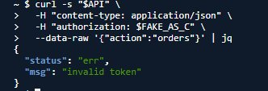
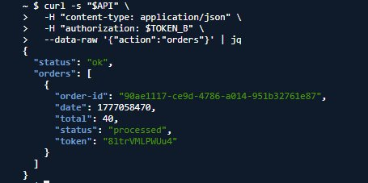

# Lesson 02 — Broken Authentication (JWT Forgery)

**OWASP Category:** API2:2019 – Broken User Authentication  
**Affected Function:** `DVSA-ORDER-MANAGER`  
**Severity:** Critical  
**Status:** ✅ Fixed and Verified

---

## 1. Goal and Vulnerability Summary

The goal of this lesson is to demonstrate how improper JWT (JSON Web Token) validation in a serverless Lambda function allows an attacker to forge tokens and impersonate any other user, gaining unauthorized access to their private order data.

The vulnerable `DVSA-ORDER-MANAGER` Lambda function accepted any structurally valid JWT without verifying its cryptographic signature. By decoding a legitimate token to learn the payload format, an attacker could craft a new token containing a different user's identity and the backend would accept it as authentic.

**Impact:** Complete account takeover. Any authenticated user could access, read, or manipulate the orders of every other user in the system.

---

## 2. Why This Works / Root Cause

JWT tokens consist of three Base64URL-encoded parts: `header.payload.signature`. The signature is produced by the issuing authority (AWS Cognito) using a private key. The recipient must verify this signature against the corresponding public key before trusting any claims in the payload.

The vulnerable code skipped this verification entirely:

```javascript
var token_sections = auth_header.split('.');
var auth_data = jose.util.base64url.decode(token_sections[1]);  // just decode
var token = JSON.parse(auth_data);
var user = token.username;  // trusted without verifying!
```

Because the signature was never checked, an attacker could supply a token with any `username` and `sub` values they chose. The function would extract those values and use them to query the database — returning the victim's data.

**Root cause:** Trusting client-controlled data (JWT payload claims) without cryptographic verification.

---

## 3. Environment and Setup

| Component | Detail |
|---|---|
| Platform | AWS Lambda (Node.js) |
| Auth Provider | AWS Cognito User Pool |
| API Endpoint | `https://oxc78p6nli.execute-api.us-east-1.amazonaws.com/Stage/order` |
| Vulnerable Function | `DVSA-ORDER-MANAGER` |
| JWT Library | `node-jose` |
| Attacker Account (User B) | `prisosteam+userb@gmail.com` |
| Victim Account (User C) | `prisosteam+userc@gmail.com` |

Two users were registered on DVSA. User B acts as the attacker. User C is the victim whose orders will be stolen.

---

## 4. Reproduction Steps

### Step 1 — Obtain legitimate JWTs for both users
Log in as each user and capture the `Authorization` header from any API request using browser DevTools (Network tab). Save these as `$TOKEN_B` and `$TOKEN_C`.

### Step 2 — Decode both tokens to extract identity fields
```python
import os, json, base64

def decode(token):
    payload = token.split(".")[1]
    payload += "=" * (-len(payload) % 4)
    return json.loads(base64.urlsafe_b64decode(payload.encode()))

for name in ["TOKEN_B", "TOKEN_C"]:
    data = decode(os.environ[name])
    print("\n" + name)
    print("username:", data.get("username"))
    print("sub     :", data.get("sub"))
```

This reveals:
- **TOKEN_B:** `username = 04782418-4041-703b-4c8f-0364aa06148d`
- **TOKEN_C:** `username = e4c8a478-0091-7020-758c-742afad11e2d`

### Step 3 — Forge a token as User C
Construct a new JWT embedding User C's `username` and `sub` in the payload. Because the signature is never verified server-side, any value in the signature section is accepted. Save the forged token as `$FAKE_AS_C`.

### Step 4 — Send the forged token to the API
```bash
curl -s "$API" \
  -H "content-type: application/json" \
  -H "authorization: $FAKE_AS_C" \
  --data-raw '{"action":"orders"}' | jq
```

The API returns User C's private orders despite User B being the authenticated party.

---

## 5. Evidence and Proof

### User B's legitimate orders (baseline)
User B has an order for *Rampage* ($40, order ID `90ae1117-ce9d-4786-a014-951b32761e87`). Querying with `$TOKEN_B` returns only their own data.



### User C's legitimate orders
User C has an order for *Super Mario 2* ($45, order ID `15fd86f0-9f9c-419b-9fba-5360fa894d20`).



### Decoded token identities
Both tokens are decoded locally to reveal the `username` and `sub` UUID fields.



### Normal behavior confirmed
With `$TOKEN_B`, User B sees only their own order — confirming baseline per-user data isolation.



### ⭐ Exploit proof — forged token returns User C's orders
Sending `$FAKE_AS_C` (forged with User C's UUID) causes the API to respond with User C's Super Mario 2 order. The server accepted the unsigned, forged token.



---

## 6. Fix Strategy / Probable Mitigation

The fix requires proper cryptographic JWT verification before any claims are trusted:

1. **Fetch Cognito's public JWKS** from the well-known endpoint for the User Pool.
2. **Verify the JWT signature** against the public key using `node-jose`.
3. **Validate standard claims:** issuer (`iss`) must match the Cognito pool URL; token must not be expired.
4. **Cache the JWKS** (6-hour TTL) to avoid redundant network calls on every Lambda invocation.
5. Only after successful verification, extract `username`/`sub` from the verified payload.

---

## 7. Code / Config Changes

### Vulnerable code (before)

```javascript
// order-manager.js — VULNERABLE
var token_sections = auth_header.split('.');
var auth_data = jose.util.base64url.decode(token_sections[1]);
var token = JSON.parse(auth_data);
var user = token.username;
var isAdmin = false;
```

No signature verification is performed. The payload is decoded and trusted directly.



### Fixed code (after)

Two new functions were added before the handler:

**`getCognitoKeystore()`** — fetches and caches Cognito public JWKS keys:
```javascript
async function getCognitoKeystore() {
    const now = Date.now();
    if (_jwksCache.keystore && (now - _jwksCache.fetchedAt) < 6 * 60 * 60 * 1000)
        return _jwksCache.keystore;
    const region = process.env.AWS_REGION;
    const userPoolId = process.env.userpoolid;
    const jwks = await fetchJson(
        `https://cognito-idp.${region}.amazonaws.com/${userPoolId}/.well-known/jwks.json`
    );
    const keystore = await jose.JWK.asKeyStore(jwks);
    _jwksCache = { keystore, fetchedAt: now };
    return keystore;
}
```

**`verifyCognitoJwt(jwt)`** — verifies signature, issuer, and expiry before trusting any claims.

The full patched file is at [`fix/order-manager-patch.js`](fix/order-manager-patch.js).



---

## 8. Verification After Fix

### Forged token rejected
After deploying the fix, the same `$FAKE_AS_C` forged token is now rejected:
```json
{ "status": "err", "msg": "invalid token" }
```



### Legitimate token still works
User B's real `$TOKEN_B` continues to return their own orders correctly — no regression introduced.



---

## 9. Structured Operation and Security Analysis

### Table A — Structured Analysis

| Vulnerability | Intended Rule(s) | Artifacts Used to Infer Rule | Normal Behavior Evidence | Exploit Behavior Evidence |
|---|---|---|---|---|
| Broken Authentication | Only a valid, cryptographically verified JWT issued by Cognito may determine user identity. User B must never access User C's orders. | Browser login and orders workflow; captured `/order` API request; JWT structure and decoded claims; `order-manager.js` source code; API responses. | Using `$TOKEN_B`, the Orders API returns only User B's own orders (Rampage, $40). User C's orders are not visible. | After replacing `username` and `sub` with User C's UUID and reusing the original signature, the forged `$FAKE_AS_C` token returns User C's order list (Super Mario 2, $45) — proving the backend never verified the signature. |

### Table B — Deviation and Fix Analysis

| Vulnerability | Why This Is a Deviation | Deviation Class | Fix Applied (Where) | Post-Fix Verification | Optional Latency Before / After |
|---|---|---|---|---|---|
| Broken Authentication | The backend trusted identity claims (`username`, `sub`) from a JWT whose integrity was never verified. Attacker-controlled payload fields were used to authorize access to another user's private data without Cognito ever issuing that token. | Intentional misuse / security-relevant abuse | Verify JWT signature and required claims (`iss`, `exp`, `token_use`) before trusting `username` or `sub`. Fix applied in `DVSA-ORDER-MANAGER/order-manager.js` via `verifyCognitoJwt()` backed by Cognito JWKS. | `$FAKE_AS_C` is rejected with `{"status":"err","msg":"invalid token"}`. User C's orders are no longer returned. `$TOKEN_B` still returns only User B's own orders correctly. | Not measured |

---

## 10. Takeaway / Lessons Learned

1. **Never trust the JWT payload without verifying the signature.** A JWT is only trustworthy after its signature has been verified against the issuer's public key. Decoding the payload without verification is equivalent to accepting unsigned user input.

2. **Use purpose-built JWT verification libraries correctly.** `node-jose` provides full verification including signature, issuer, audience, and expiry. Manual Base64 decoding bypasses all of these protections.

3. **In AWS, always validate against the Cognito JWKS endpoint.** AWS Cognito exposes public keys at a well-known URL. Lambda functions must fetch and cache these keys and verify every incoming token against them.

4. **Serverless does not mean secure by default.** Lambda functions are just code — they inherit all the same vulnerability classes as traditional applications. Authentication logic must be implemented correctly regardless of the deployment model.

5. **The fix is inexpensive; the breach is not.** Proper JWT verification adds a single async function call with a local cache. The cost of not doing it is full account takeover for every user in the system.
