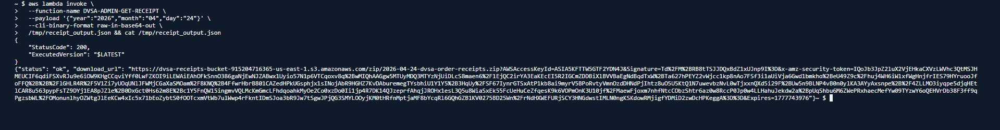
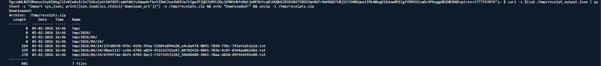
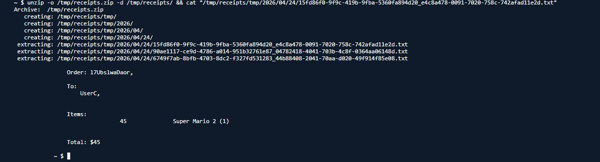
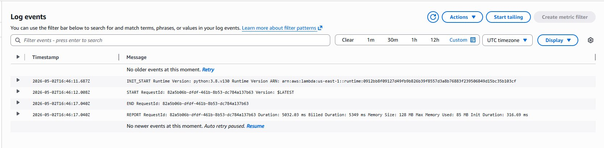
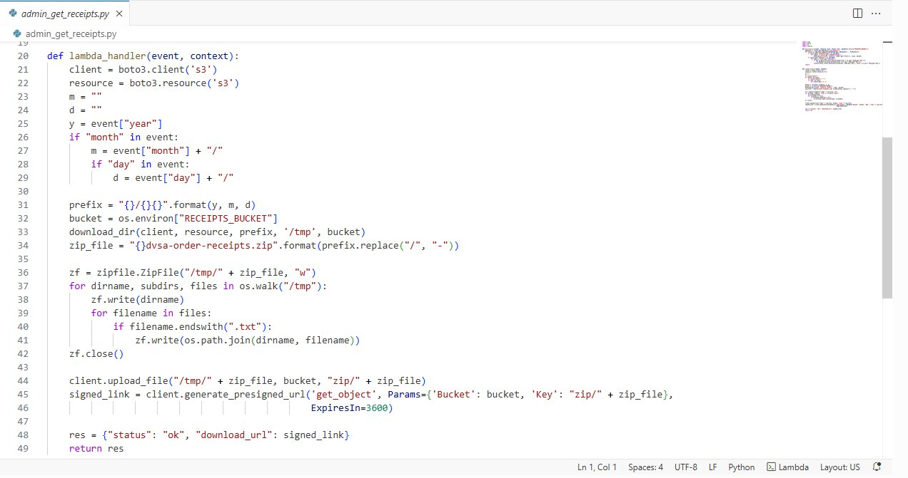
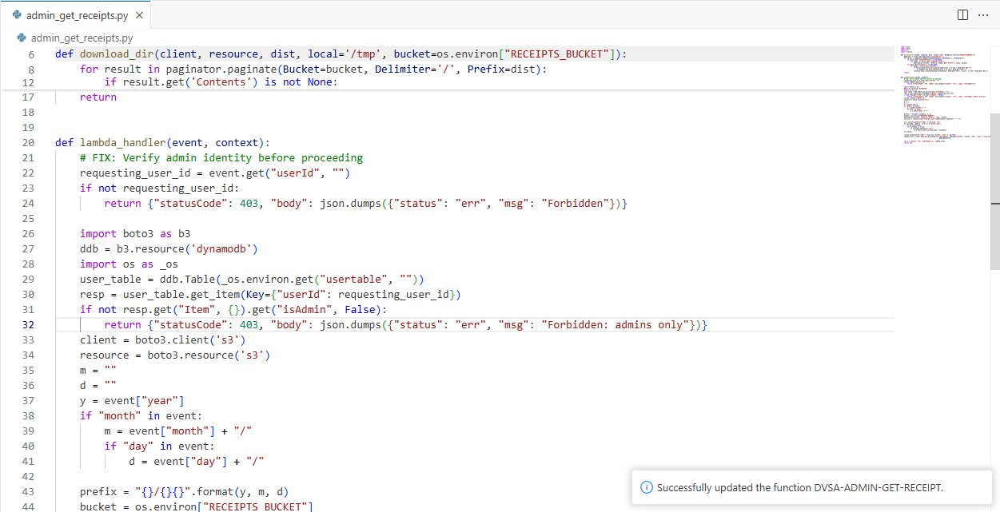
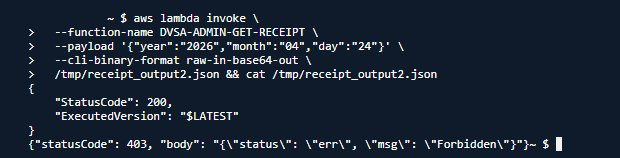

# Lesson 03 — Sensitive Data Exposure (Admin Receipt Disclosure)

**OWASP Category:** A3:2017 – Sensitive Data Exposure  
**Affected Function:** `DVSA-ADMIN-GET-RECEIPT`  
**Severity:** Critical  
**Status:** ✅ Fixed and Verified

---

## 1. Goal and Vulnerability Summary

The goal of this lesson is to demonstrate how a sensitive admin-only Lambda function (`DVSA-ADMIN-GET-RECEIPT`) was accessible to any authenticated user without any authorization check. The function was designed to package all receipt files from S3 into a ZIP archive and return a presigned download URL — an operation intended exclusively for administrators.

Because no identity or role check existed inside the function, any user who could invoke it (directly via the AWS SDK or CLI) could obtain a presigned URL that exposed the private receipts of every user in the system.

**Impact:** Complete exposure of all users' order receipt data. An attacker with any valid AWS session or through code injection could download a ZIP archive containing the private receipt files of every customer who ever placed an order.

---

## 2. Why This Works / Root Cause

The `DVSA-ADMIN-GET-RECEIPT` Lambda function was designed as an admin utility. Its purpose is to:
1. Download all receipt `.txt` files from the S3 receipts bucket for a given date.
2. Package them into a ZIP archive.
3. Upload the ZIP back to S3.
4. Return a presigned URL to download the ZIP.

The critical flaw is that the `lambda_handler` function begins processing immediately upon invocation — it reads `event["year"]`, `event["month"]`, and `event["day"]` and proceeds directly to S3 operations without ever checking whether the caller is an administrator.

```python
# VULNERABLE — admin_get_receipts.py (before fix)
def lambda_handler(event, context):
    client = boto3.client('s3')
    resource = boto3.resource('s3')
    y = event["year"]          # No authorization check before this
    if "month" in event:
        m = event["month"] + "/"
        ...
    # Proceeds directly to download all receipts and return signed URL
```

**Root cause:** Missing authorization gate at the function entry point. The function trusted that only admins would invoke it, relying on obscurity rather than enforcement.

---

## 3. Environment and Setup

| Component | Detail |
|---|---|
| Platform | AWS Lambda (Python 3.8) |
| Affected Function | `DVSA-ADMIN-GET-RECEIPT` |
| Storage | S3 receipts bucket (`dvsa-receipts-bucket-*`) |
| API Endpoint | `https://oxc78p6nli.execute-api.us-east-1.amazonaws.com/Stage/admin` |
| Attacker Account | User B (regular non-admin user) |
| Victim Account | User C (order `15fd86f0-9f9c-419b-9fba-5360fa894d20`) |
| Tools | AWS CLI, CloudShell, CloudWatch Logs |

---

## 4. Reproduction Steps

### Step 1 — Confirm User C has an order with a receipt
User C placed an order for *Super Mario 2* ($45). The receipt was generated and stored in the S3 receipts bucket at path `2026/04/24/`.

### Step 2 — Invoke the admin receipt function as a regular user
Using the AWS CLI (available to any authenticated session in CloudShell), directly invoke the `DVSA-ADMIN-GET-RECEIPT` Lambda function with a date payload:

```bash
aws lambda invoke \
  --function-name DVSA-ADMIN-GET-RECEIPT \
  --payload '{"year":"2026","month":"04","day":"24"}' \
  --cli-binary-format raw-in-base64-out \
  /tmp/receipt_output.json && cat /tmp/receipt_output.json
```

The function responds with a presigned S3 URL to download a ZIP of all receipts — no admin check was performed.

### Step 3 — Download the ZIP archive of all receipts
```bash
curl -s $(cat /tmp/receipt_output.json | python3 -c \
  "import sys,json; print(json.load(sys.stdin)['download_url'])") \
  -o /tmp/receipts.zip && unzip -l /tmp/receipts.zip
```

The ZIP contains receipt files for all users who placed orders on that date.

### Step 4 — Read User C's private receipt
```bash
unzip -o /tmp/receipts.zip -d /tmp/receipts/ && \
  cat "/tmp/receipts/tmp/2026/04/24/15fd86f0-9f9c-419b-9fba-5360fa894d20_e4c8a478-0091-7020-758c-742afad11e2d.txt"
```

The receipt reveals User C's order details including name, items, and total — all obtained by a non-admin user.

---

## 5. Evidence and Proof

### Admin function returns presigned URL to non-admin user
Invoking `DVSA-ADMIN-GET-RECEIPT` as User B (a regular non-admin) returns a valid presigned S3 URL with HTTP 200.



### ZIP archive contains receipts from all users
The downloaded ZIP contains receipt files for multiple users — not just the attacker's own data.



### User C's private receipt fully exposed
Extracting and reading the receipt file for order `15fd86f0` reveals User C's private order data: name, item (*Super Mario 2*), and total ($45).



### CloudWatch confirms admin function was invoked
The log group `/aws/lambda/DVSA-ADMIN-GET-RECEIPT` shows a successful invocation at 2026-05-02T16:46 UTC — matching the time of the exploit.



### Vulnerable code — no authorization check
The `lambda_handler` in `admin_get_receipts.py` proceeds directly to S3 operations without any admin identity verification.



---

## 6. Fix Strategy / Probable Mitigation

The fix requires adding an authorization gate at the entry point of `lambda_handler`:

1. **Extract the requesting user's identity** from the event (e.g., a `userId` field).
2. **Look up the user in DynamoDB** using the users table.
3. **Check the `isAdmin` attribute** — if it is not `True`, return a 403 Forbidden response immediately.
4. Only if the caller is confirmed as an admin should the function proceed to S3 operations.

This follows the principle of **least privilege** — the function should enforce its own access control rather than relying on the caller to self-identify as an admin.

---

## 7. Code / Config Changes

### Vulnerable code (before)

```python
# admin_get_receipts.py — VULNERABLE
def lambda_handler(event, context):
    client = boto3.client('s3')
    resource = boto3.resource('s3')
    m = ""
    d = ""
    y = event["year"]
    # No authorization check — proceeds directly to S3
```

### Fixed code (after)

```python
# admin_get_receipts.py — FIXED
def lambda_handler(event, context):
    # FIX: Verify admin identity before proceeding
    requesting_user_id = event.get("userId", "")
    if not requesting_user_id:
        return {"statusCode": 403, "body": json.dumps({"status": "err", "msg": "Forbidden"})}

    import boto3 as b3
    ddb = b3.resource('dynamodb')
    import os as _os
    user_table = ddb.Table(_os.environ.get("usertable", ""))
    resp = user_table.get_item(Key={"userId": requesting_user_id})
    if not resp.get("Item", {}).get("isAdmin", False):
        return {"statusCode": 403, "body": json.dumps({"status": "err", "msg": "Forbidden: admins only"})}

    # Original code continues only for verified admins
    client = boto3.client('s3')
    resource = boto3.resource('s3')
```



---

## 8. Verification After Fix

After deploying the fix, the same invocation command now returns a 403 Forbidden response:

```bash
aws lambda invoke \
  --function-name DVSA-ADMIN-GET-RECEIPT \
  --payload '{"year":"2026","month":"04","day":"24"}' \
  --cli-binary-format raw-in-base64-out \
  /tmp/receipt_output2.json && cat /tmp/receipt_output2.json
```

**Result:**
```json
{"statusCode": 403, "body": "{\"status\": \"err\", \"msg\": \"Forbidden\"}"}
```



---

## 9. Structured Operation and Security Analysis

### Table A — Structured Analysis

| Vulnerability | Intended Rule(s) | Artifacts Used to Infer Rule | Normal Behavior Evidence | Exploit Behavior Evidence |
|---|---|---|---|---|
| Sensitive Data Exposure | Only verified admin users may invoke `DVSA-ADMIN-GET-RECEIPT`. Non-admin users must never obtain receipts belonging to other users. | DVSA admin function design; `admin_get_receipts.py` source code; S3 receipts bucket structure; CloudWatch invocation logs; AWS CLI invocation response. | A legitimate admin invoking the function with a valid `userId` marked `isAdmin=True` in DynamoDB would receive the presigned ZIP URL. Regular users should receive a 403 rejection. | Invoking the function as User B (non-admin) with no `userId` field returned a valid presigned URL. The downloaded ZIP contained receipt files for all users including User C's private order for Super Mario 2 ($45). |

### Table B — Deviation and Fix Analysis

| Vulnerability | Why This Is a Deviation | Deviation Class | Fix Applied (Where) | Post-Fix Verification | Optional Latency Before / After |
|---|---|---|---|---|---|
| Sensitive Data Exposure | The function was designed as an admin-only utility but contained no enforcement of that intent. Any caller — regardless of identity or role — could invoke it and receive all users' receipts. This violates the intended authorization boundary and exposes private customer data to unauthorized parties. | Intentional misuse / security-relevant abuse | Authorization check added at the entry point of `lambda_handler` in `DVSA-ADMIN-GET-RECEIPT/admin_get_receipts.py`. The fix verifies `userId` against DynamoDB `isAdmin` attribute before proceeding. | Invoking the function without a valid admin `userId` now returns `{"statusCode": 403, "body": "{\"status\": \"err\", \"msg\": \"Forbidden\"}"}`. The presigned URL is no longer returned to unauthorized callers. | Not measured |

---

## 10. Takeaway / Lessons Learned

1. **Admin functions must enforce their own access control.** Relying on the caller to "know" they should only call this function if they are an admin is not security — it is obscurity. Every sensitive function must verify the caller's identity and role before executing.

2. **Direct Lambda invocation bypasses API Gateway controls.** Even if an API Gateway endpoint enforces authentication, Lambda functions can be invoked directly via the AWS SDK or CLI by anyone with `lambda:InvokeFunction` permission. Functions must implement their own authorization checks.

3. **Sensitive data in S3 is only as secure as the code that generates access to it.** The receipts bucket itself was not publicly accessible, but the function that generated presigned URLs had no gate — making the bucket's access controls irrelevant.

4. **Least privilege applies to both IAM roles and function logic.** IAM controls what a function *can* do; function-level authorization controls who *should* trigger it. Both layers are necessary.

5. **In serverless architectures, every function is a potential entry point.** Unlike monolithic applications where a single authentication middleware protects all routes, each Lambda function is independently invokable and must independently enforce access control.
