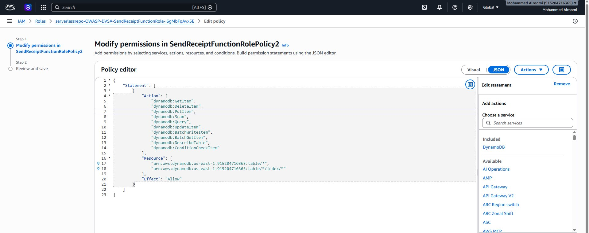
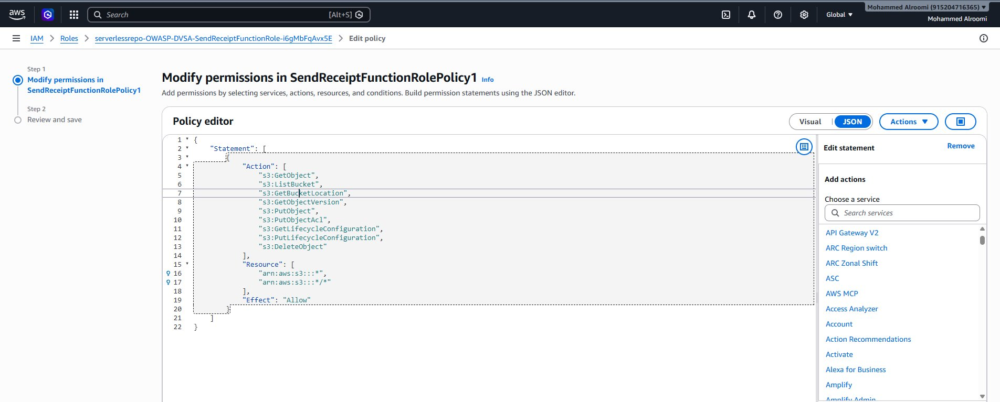
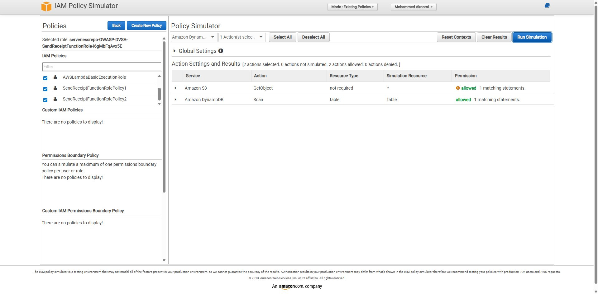
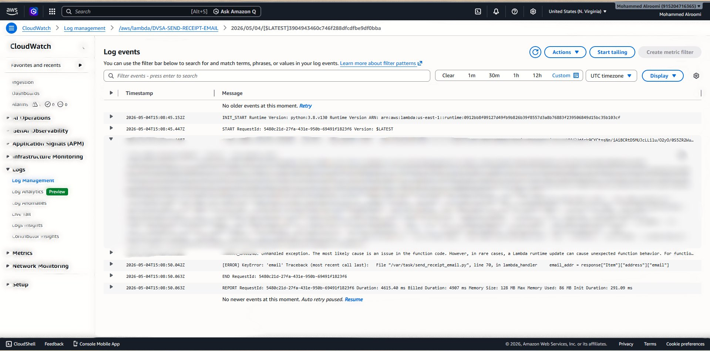
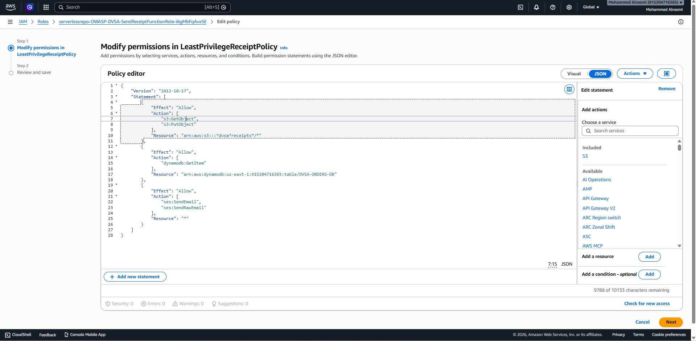

# Lesson 07 — Over-Privileged Functions (IAM Blast Radius)

**OWASP Category:** Serverless:7 – Over-Privileged Function Permissions  
**Affected Function:** `DVSA-SEND-RECEIPT-EMAIL`  
**Severity:** Critical  
**Status:** ✅ Fixed and Verified

---

## 1. Goal and Vulnerability Summary

The goal of this lesson is to demonstrate how an over-privileged IAM execution role attached to a Lambda function dramatically increases the blast radius of any compromise. The `DVSA-SEND-RECEIPT-EMAIL` function exists solely to send a receipt email after an order is placed. Its role, however, grants unrestricted read/write access to every S3 bucket and every DynamoDB table in the account, as well as full SES administrative permissions.

By temporarily modifying the function to print its environment variables (simulating what an attacker could achieve through code injection or a vulnerable dependency), the temporary STS credentials embedded in those variables can be extracted and used locally to impersonate the function's identity — and perform any AWS action the role permits, including scanning the entire customer orders database.

**Impact:** Complete data breach. Any attacker who achieves code execution inside the function (via injection, supply-chain compromise, or misconfigured event input) immediately inherits account-wide S3, DynamoDB, and SES permissions — far beyond what the function needs to send a single receipt email.

---

## 2. Why This Works / Root Cause

In AWS serverless systems, every Lambda function runs with an IAM execution role. The function's temporary credentials (issued by STS) are automatically injected into the Lambda runtime environment as `AWS_ACCESS_KEY_ID`, `AWS_SECRET_ACCESS_KEY`, and `AWS_SESSION_TOKEN`. Any code running inside the function — including injected code — can read and use these credentials.

The root cause is **over-privileged role design**. The attached policies used wildcard resources:

```json
"Resource": ["arn:aws:s3:::*", "arn:aws:s3:::*/*"]
"Resource": ["arn:aws:dynamodb:us-east-1:*:table/*", "arn:aws:dynamodb:us-east-1:*:table/*/index/*"]
```

This means the role has permission to read, write, and delete objects in **any** S3 bucket and scan, modify, or delete items in **any** DynamoDB table — not just the DVSA receipts resources. The function also had `AmazonSESFullAccess` attached, granting full administrative SES control far beyond the single `ses:SendEmail` action it actually needs.

**Root cause:** Failure to enforce the Principle of Least Privilege on the Lambda execution role.

---

## 3. Environment and Setup

| Component | Detail |
|---|---|
| Platform | AWS Lambda (Python 3.8) |
| Vulnerable Function | `DVSA-SEND-RECEIPT-EMAIL` |
| Vulnerable File | `send_receipt_email.py` |
| Execution Role | `serverlessrepo-OWASP-DVSA-SendReceiptFunctionRole-i6gMbFqAvx5E` |
| Over-Privileged Policies | `SendReceiptFunctionRolePolicy1` (S3), `SendReceiptFunctionRolePolicy2` (DynamoDB), `AmazonSESFullAccess` |
| Evidence Tool | IAM Policy Simulator (`https://policysim.aws.amazon.com`) |
| Exploit Tool | AWS CLI with stolen STS credentials |
| Target Table | `DVSA-ORDERS-DB` |
| AWS Region | `us-east-1` |

---

## 4. Reproduction Steps

### Step 1 — Identify the execution role
Navigate to **Lambda → DVSA-SEND-RECEIPT-EMAIL → Configuration → Permissions** and open the execution role in IAM. Review the attached policies.

### Step 2 — Confirm over-privilege in policy JSON
Open `SendReceiptFunctionRolePolicy1` and observe:
```json
"Resource": ["arn:aws:s3:::*", "arn:aws:s3:::*/*"]
```
Open `SendReceiptFunctionRolePolicy2` and observe:
```json
"Resource": [
  "arn:aws:dynamodb:us-east-1:915204716365:table/*",
  "arn:aws:dynamodb:us-east-1:915204716365:table/*/index/*"
]
```

### Step 3 — Confirm with IAM Policy Simulator
In the IAM Policy Simulator, select the role and run `s3:GetObject` and `dynamodb:Scan` against arbitrary non-DVSA resources. Both return **Allowed**, confirming the role can access resources unrelated to its purpose.

### Step 4 — Simulate credential theft via environment variable exposure
Add the following line to `send_receipt_email.py` immediately after `def lambda_handler(event, context):`:
```python
print(dict(os.environ))
```
Deploy the function, then trigger it by placing a new order on the DVSA website.

### Step 5 — Extract credentials from CloudWatch
Navigate to **CloudWatch → /aws/lambda/DVSA-SEND-RECEIPT-EMAIL → most recent log stream**. Locate the printed environment dictionary and extract:
- `AWS_ACCESS_KEY_ID`
- `AWS_SECRET_ACCESS_KEY`
- `AWS_SESSION_TOKEN`

### Step 6 — Assume the function's identity locally
```bash
export AWS_ACCESS_KEY_ID="<value from logs>"
export AWS_SECRET_ACCESS_KEY="<value from logs>"
export AWS_SESSION_TOKEN="<value from logs>"
```

### Step 7 — Exploit the over-privileged role
```bash
aws dynamodb scan --table-name DVSA-ORDERS-DB --region us-east-1
```
The entire customer orders database is returned, demonstrating a complete data breach using only the stolen Lambda credentials.

---

## 5. Evidence and Proof

### DynamoDB wildcard policy (SendReceiptFunctionRolePolicy2)
The policy grants full DynamoDB access across all tables in the account using `table/*` wildcards.



### S3 wildcard policy (SendReceiptFunctionRolePolicy1)
The policy grants S3 actions across all buckets and all objects — far beyond the single DVSA receipts bucket.



### IAM Policy Simulator — both actions Allowed
`s3:GetObject` and `dynamodb:Scan` are both **Allowed** for non-DVSA resources, confirming the blast radius extends beyond the function's intended scope.



### Credentials exposed in CloudWatch
The `print(dict(os.environ))` line causes the Lambda runtime to log all environment variables including the temporary STS credentials.



### ⭐ Exploit proof — full orders database dumped
Using the stolen credentials locally, `aws dynamodb scan` returns every customer order in `DVSA-ORDERS-DB` — demonstrating a complete data breach.


---

## 6. Fix Strategy / Probable Mitigation

The fix applies the **Principle of Least Privilege** to the execution role:

1. **Remove** `SendReceiptFunctionRolePolicy1` (wildcard S3 access)
2. **Remove** `SendReceiptFunctionRolePolicy2` (wildcard DynamoDB access)
3. **Remove** `AmazonSESFullAccess` (full SES admin)
4. **Add** a new inline policy `LeastPrivilegeReceiptPolicy` that grants only:
   - `s3:GetObject` and `s3:PutObject` scoped to the DVSA receipts bucket only
   - `dynamodb:GetItem` scoped to `DVSA-ORDERS-DB` only
   - `ses:SendEmail` and `ses:SendRawEmail` for sending receipts
5. **Remove** the `print(dict(os.environ))` line from the function code

---

## 7. Code / Config Changes

### Vulnerable policies (before)

`SendReceiptFunctionRolePolicy1` — S3 wildcard:
```json
{
  "Action": ["s3:GetObject", "s3:ListBucket", "s3:PutObject", "s3:DeleteObject", "..."],
  "Resource": ["arn:aws:s3:::*", "arn:aws:s3:::*/*"],
  "Effect": "Allow"
}
```

`SendReceiptFunctionRolePolicy2` — DynamoDB wildcard:
```json
{
  "Action": ["dynamodb:GetItem", "dynamodb:Scan", "dynamodb:PutItem", "dynamodb:DeleteItem", "..."],
  "Resource": [
    "arn:aws:dynamodb:us-east-1:915204716365:table/*",
    "arn:aws:dynamodb:us-east-1:915204716365:table/*/index/*"
  ],
  "Effect": "Allow"
}
```

### Fixed policy (after) — `LeastPrivilegeReceiptPolicy`

```json
{
  "Version": "2012-10-17",
  "Statement": [
    {
      "Effect": "Allow",
      "Action": ["s3:GetObject", "s3:PutObject"],
      "Resource": "arn:aws:s3:::*dvsa*receipts*/*"
    },
    {
      "Effect": "Allow",
      "Action": ["dynamodb:GetItem"],
      "Resource": "arn:aws:dynamodb:us-east-1:915204716365:table/DVSA-ORDERS-DB"
    },
    {
      "Effect": "Allow",
      "Action": ["ses:SendEmail", "ses:SendRawEmail"],
      "Resource": "*"
    }
  ]
}
```



---

## 8. Verification After Fix

### Policy Simulator — actions now Denied
After applying `LeastPrivilegeReceiptPolicy` and removing the wildcard policies, re-running the same simulation confirms that `s3:GetObject`, `s3:PutObject`, `dynamodb:Scan`, and `dynamodb:DeleteItem` on arbitrary non-DVSA resources are now **Denied**.


### Function still operates correctly
A new order placed after the fix triggers `DVSA-SEND-RECEIPT-EMAIL` successfully. CloudWatch confirms a clean invocation with no credentials printed and no errors related to the permission change.


---

## 9. Structured Operation and Security Analysis

### Table A — Structured Analysis

| Vulnerability | Intended Rule(s) | Artifacts Used to Infer Rule | Normal Behavior Evidence | Exploit Behavior Evidence |
|---|---|---|---|---|
| Over-Privileged Function | The `DVSA-SEND-RECEIPT-EMAIL` function must only be able to read/write objects in the DVSA receipts S3 bucket, read the specific order from `DVSA-ORDERS-DB`, and send email via SES. It must not access any other AWS resource. | IAM role permissions tab; `SendReceiptFunctionRolePolicy1` and `SendReceiptFunctionRolePolicy2` JSON; IAM Policy Simulator results; CloudWatch logs; AWS CLI `dynamodb scan` output. | The function is invoked after an order is placed, sends a receipt email, and terminates — interacting only with S3 and DynamoDB for that specific order. No access to unrelated resources is required. | After extracting temporary STS credentials from CloudWatch logs (simulating code injection), the stolen credentials were used to run `aws dynamodb scan --table-name DVSA-ORDERS-DB` locally, successfully returning all customer orders — far beyond the function's intended scope. |

### Table B — Deviation and Fix Analysis

| Vulnerability | Why This Is a Deviation | Deviation Class | Fix Applied (Where) | Post-Fix Verification | Optional Latency Before / After |
|---|---|---|---|---|---|
| Over-Privileged Function | The execution role granted wildcard S3 and DynamoDB permissions that allow the function (or any attacker who compromises it) to access every bucket and every table in the account. This violates the intended rule that the function should only access resources required for sending a single receipt — all other AWS actions and resources are out of scope. | Accidental misconfiguration | Replaced `SendReceiptFunctionRolePolicy1`, `SendReceiptFunctionRolePolicy2`, and `AmazonSESFullAccess` with a new inline policy `LeastPrivilegeReceiptPolicy` scoped to the receipts bucket, `DVSA-ORDERS-DB`, and minimal SES send actions only. Applied in IAM on the `SendReceiptFunctionRole`. | IAM Policy Simulator confirms `s3:GetObject`, `s3:PutObject`, `dynamodb:Scan`, and `dynamodb:DeleteItem` on non-DVSA resources are now **Denied**. Function continues to invoke successfully after a new order. | Not measured |

---

## 10. Takeaway / Lessons Learned

1. **In serverless, the function role is the security perimeter.** Unlike a traditional server where an attacker must escalate privileges separately, a Lambda function's temporary credentials are immediately available to any code running inside it. Over-privilege therefore converts any code execution flaw into an account-level breach.

2. **Blast radius is a design decision.** The difference between a contained incident and a full data breach is determined at role design time — before any vulnerability is found. Wildcard resources expand blast radius unnecessarily.

3. **Least Privilege must be resource-scoped, not just action-scoped.** Allowing only `dynamodb:GetItem` is not enough if it applies to `table/*`. The resource ARN must be pinned to the exact table, bucket, and object prefix the function needs.

4. **CloudTrail and IAM Access Analyzer help right-size roles.** AWS provides tooling (IAM policy generation from CloudTrail activity) to determine the minimum permissions a function actually uses. There is no justification for not using these tools during deployment.

5. **The fix is architectural, not cosmetic.** Removing wildcard policies and replacing them with scoped ones does not change the function's legitimate behavior — but it ensures that any future compromise of this function cannot be used to pivot to unrelated resources.
